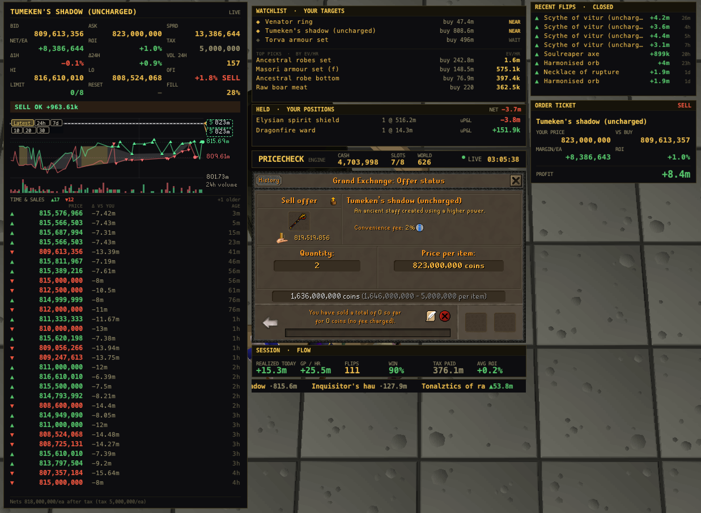
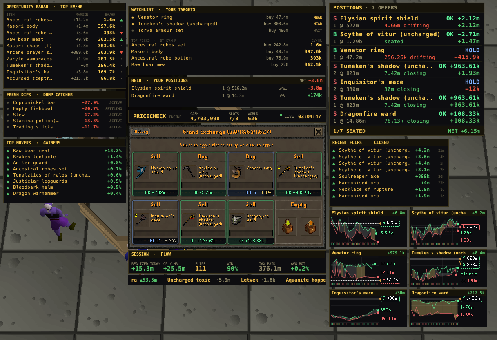

# PriceCheck Flipping

[](https://discord.gg/pricecheck)
[](https://www.reddit.com/user/pricecheckgg/)
[](https://flipping.pricecheck.gg)

The OSRS flip terminal, inside RuneLite. The flip log is free for everyone and
books every Grand Exchange fill to the exact coin. Trader Pro adds a live desk
beside the exchange: a ranked flip board, an offer advisor, and a full evidence
card on every item you touch.



One client, one real position. On the left, the item's traded corridor with your
offer tagged on it, its 24h volume, and the trades printing in real time, each one
measured against your own price. Around it sit your watchlist, the positions you
are holding, and a live order ticket reading the exact profit on the offer you are
typing. Your closed flips and session P&L run alongside. Nothing here is mocked.

## Free: the flip log

Works with no account and no key. Everything runs locally in your client.

<p>


</p>

- Every GE fill logged the moment it lands, exact to the coin, GE tax included.
- Buys matched into flips (FIFO with exact cost); open positions carry their cost
  basis and hold time.
- Session profit with honest active-time gp/hr, daily and weekly totals, win rate,
  and tax paid. Margin checks are tagged and kept out of the win rate.
- Losses are booked as honestly as the wins.

Optional and off by default, **Sync flip log** backs the log up to your PriceCheck
account, shows it at [flipping.pricecheck.gg/portfolio](https://flipping.pricecheck.gg/portfolio),
and keeps it consistent across machines. Keys are free (Discord login).

## Trader Pro: the terminal desk



With a Trader Pro key the whole exchange lights up. Every open offer wears its
verdict, each item draws its own evidence chart, and a column of live panels frames
the board:

- **Opportunity radar, fresh dips, top movers.** The market ranked in real time by
  post-tax gp/hr, live dumps worth catching, and the biggest gainers.
- **A verdict on every slot.** Each offer reads seated, raise, hold, or cut, with
  the exact price to move to.
- **Positions blotter.** All your live offers with their fill state and running
  profit, and a chart for each item you are holding.
- **Watchlist.** Your entry targets and how close the market is to each one.
- **Offer advisor.** Turns your open slots into precise, post-tax instructions.

The board and its numbers come from PriceCheck's servers; the plugin holds no
market data and no engine of its own.

## Click to fill


When the GE asks for a price, one click types ours, cut to fill first in the queue.
You still press Enter yourself.

## The leaderboard

[](https://flipping.pricecheck.gg/leaderboard)

Live standings from real logged fills, updating as members flip. Names show only
for members who made their portfolio public; everyone else ranks anonymously. Sync
your log and you are on the board.

## Data disclosure

The plugin makes no network request until you enter a plugin key. With a key,
requests to PriceCheck's servers necessarily include your IP address. Every other
send is off by default, individually toggled, and does exactly what its config
warning states: **Sync flip log** sends your GE trades and open positions under an
anonymous per-account identifier; **Contribute market data** sends your own GE
offer fill events. While a PriceCheck trial is active, the plugin sends that same
anonymous per-account identifier once per game account, to bind the trial to it, as
the trial terms state. Your RuneScape name, game credentials, and chat are never
read or sent. PriceCheck's servers are not controlled or verified by the RuneLite
Developers.

## Build

```
./gradlew build
```

Java 11. The sideloadable jar lands in `build/libs/`.

## Test locally (developer mode)

1. Copy `build/libs/pricecheck-<version>.jar` into `~/.runelite/sideloaded-plugins/`
   (Windows: `%USERPROFILE%\.runelite\sideloaded-plugins\`).
2. Launch RuneLite with `--developer-mode`.
3. The PriceCheck panel appears in the sidebar; the flip log works immediately.

## Layout

- `FlipLogEngine` - the local ledger: exact fills from offer-delta math, FIFO flip
  matching, atomic persistence per game account, multi-machine adoption.
- `PriceCheckPlugin` - lifecycle, event intake, pollers.
- `PriceCheckPanel` - the sidebar (Flips, Log, Settings).
- `PriceCheckApiClient` - the only network surface: a Bearer key, JSON in and out.
- `GeItemCardOverlay` + `GeItemInfoPainter` + `ChartKit` - the evidence cards and charts.
- `Terminal*Overlay` - the desk panels: radar, watchlist, positions blotter,
  session strip, ticker, and order ticket.
- `GeChatboxHelper` - click-to-fill prices and GE search suggestions.
- `TelemetryCollector` - the opt-in market-data contribution queue.
- `GeTax` - GE tax exactly as the game applies it (2% floored, 5m cap).

## License and trademarks

The source code is BSD 2-Clause (see [LICENSE](LICENSE)); that grant covers the
code only. The PriceCheck name and wordmark, the logo and `icon.png`, the
screenshots under `docs/`, and the pricecheck.gg service and its API are reserved
and not licensed for reuse (see [NOTICE](NOTICE)). Forks must ship under a different
name and icon.

Not affiliated with Jagex Ltd. RuneScape and Old School RuneScape are trademarks of
Jagex Ltd.
