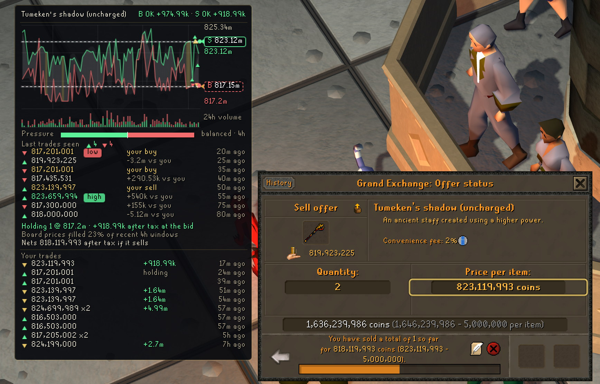
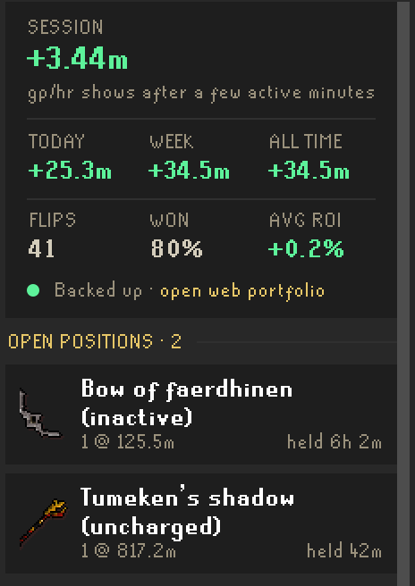
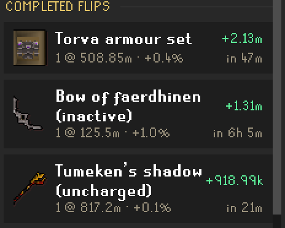
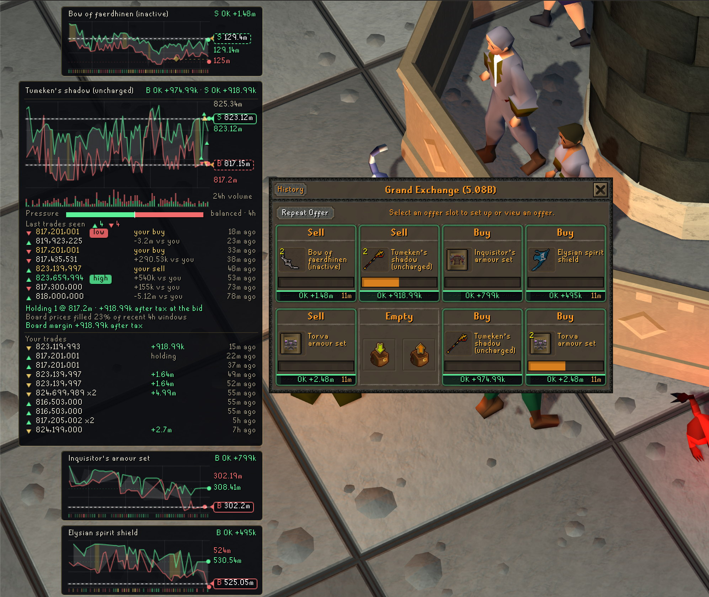
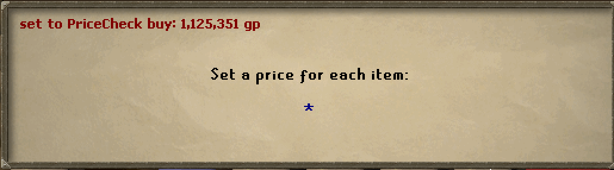

# PriceCheck Flipping

[](https://discord.gg/pricecheck)
[](https://www.reddit.com/user/pricecheckgg/)
[](https://flipping.pricecheck.gg)

The OSRS flip terminal, inside RuneLite. The flip log is free for everyone
and books every GE fill to the exact coin. Subscribers get the live board,
an offer advisor, and a per-item evidence card drawn beside the exchange.



That is a real client and a real position: the day's traded corridor with
your offers tagged on it, 24h volume with buy and sell pressure, the last
trades as they print with your own fills marked in gold, and your history
on the item at the foot of the card.

## Free: the flip log

Works with no account and no key. Everything runs locally in your client.

<p>


</p>

- Every GE fill logged the moment it lands, exact to the coin, GE tax included.
- Buys matched into flips (FIFO with exact cost), open positions with cost
  basis and hold time.
- Session profit with honest active-time gp/hr, daily and weekly totals, win
  rate, tax paid. Margin checks are tagged and kept out of the win rate.
- Losses are booked as honestly as the wins.

Optional, off by default: **Sync flip log** backs the log up to your
PriceCheck account, shows it at
[flipping.pricecheck.gg/portfolio](https://flipping.pricecheck.gg/portfolio),
and keeps the log consistent across multiple computers. Keys are free
(Discord login).

## The whole board



With a Trader Pro key, every offer on the exchange carries its evidence: a
verdict chip under each slot, a mini card per item with its own chart, and
any card expands into the full read. The sidebar adds the live flip board
(post-tax margins ranked by expected gp/hr), an offer advisor for your open
slots, your flips inside the GE item search, and a bank-aware slot planner.

## Click to fill



When the GE asks for a price, one click types ours: cut to fill first in the
queue. You still press Enter yourself.

## The leaderboard

[](https://flipping.pricecheck.gg/leaderboard)

Live standings from real logged fills, updating as members flip. Names show
only for members who made their portfolio public; everyone else ranks
anonymously. Sync your log and you are on the board.

## Data disclosure

The plugin makes no network requests until you enter a plugin key. With a key,
requests to PriceCheck's servers necessarily include your IP address. Optional
features, each off by default and individually toggled, send exactly what
their config warning states: the flip-log sync sends your GE trades and open
positions with an anonymous per-account identifier; "Contribute market data"
sends your own GE offer fill events; the planner's capital auto-detect sends
your liquid gp total. While a PriceCheck trial is active, the plugin sends
that same anonymous per-account identifier once per game account to bind the
trial to it, as the trial terms state. Your RSN, game credentials, and chat
are never read or sent. PriceCheck's servers are not controlled or verified by the RuneLite
Developers.

## Build

```
./gradlew build
```

Java 11. The sideloadable jar lands in `build/libs/`.

## Test locally (developer mode)

1. Copy `build/libs/pricecheck-<version>.jar` into `~/.runelite/sideloaded-plugins/`
   (Windows: `%USERPROFILE%\.runelite\sideloaded-plugins\`).
2. Launch RuneLite with `--developer-mode`.
3. The PriceCheck panel appears in the sidebar; the flip log works immediately.

## Layout

- `FlipLogEngine` - the local ledger: exact fills from offer-delta math, FIFO
  flip matching, atomic persistence per game account, multi-machine adoption.
- `PriceCheckPlugin` - lifecycle, event intake, pollers.
- `PriceCheckPanel` - sidebar (Flips, Log, Plan, Settings tabs).
- `PriceCheckApiClient` - all network calls; a Bearer key and JSON in/out.
- `GeItemCardOverlay` + `GeItemInfoPainter` + `ChartKit` - the evidence cards.
- `GeChatboxHelper` - click-to-fill price lines and GE search suggestions.
- `TelemetryCollector` - the opt-in market-data contribution queue.
- `GeTax` - GE tax exactly as the game applies it (2% floored, 5m cap).

Not affiliated with Jagex Ltd. RuneScape and Old School RuneScape are
trademarks of Jagex Ltd.
